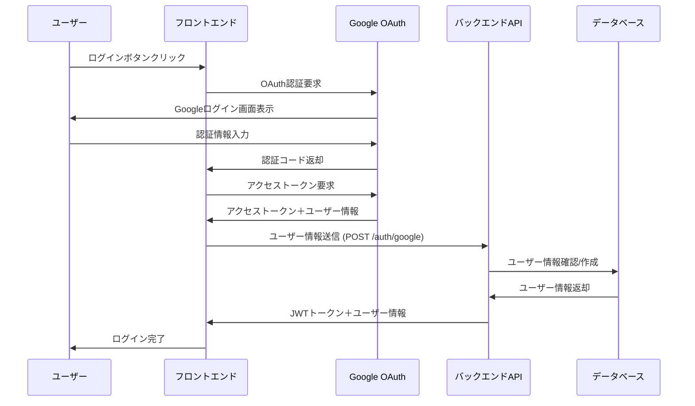

# Google認証機能の実装

## 雑なフローメモ

- フロントエンドからGoogle Oauth同意画面に遷移
- 同意後にFEにコールバックして、トークンを取得する
- トークンをFEからバックエンドに送信
- バックエンドでトークンを検証し、ユーザー情報を取得
- ユーザー情報をDBに保存し、ログインに必要なjwt_tokenを作成
- jwt_tokenをFEに返却
- FEはjwt_tokenをローカルストレージに保存する
- ログイン後のAPIを使う際は、FEはjwt_tokenをAuthorizationヘッダーにセットしてAPIリクエストを送信

## シーケンス図


  å
## APIエンドポイント

### 1. POST /api/v1/auth/google
- **用途**: クライアントサイドOAuth
- **フロー**: フロントエンドで取得したGoogleトークンを検証・処理
- **リクエスト**:
  ```json
  {
    "token": "eyJhbGciOiJSUzI1NiIsImtpZCI6IjdkYzAifQ..."
  }
  ```
- **レスポンス**:
  ```json
  {
    "token": "eyJhbGciOiJIUzI1NiJ9.eyJ1c2VyX2lkIjoxLCJleHAiOjE2...",
    "user": {
      "id": 1,
      "email": "user@example.com",
      "name": "John Doe",
      "image": "https://lh3.googleusercontent.com/a/default-user"
    }
  }
  ```
