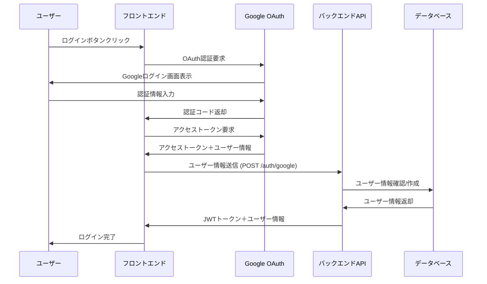

# Google認証機能の実装

## 雑なフローメモ

- フロントエンドからGoogle Oauth同意画面に遷移
- 同意後にFEにコールバックして、トークンを取得する
- トークンをFEからバックエンドに送信
- バックエンドでトークンを検証し、ユーザー情報を取得
- ユーザー情報をDBに保存し、ログインに必要なjwt_tokenを作成
- jwt_tokenをFEに返却
- FEはjwt_tokenをローカルストレージに保存する
- ログイン後のAPIを使う際は、FEはjwt_tokenをAuthorizationヘッダーにセットしてAPIリクエストを送信

## シーケンス図



## APIエンドポイント

### 1. POST /api/v1/auth/google
- **用途**: クライアントサイドOAuth
- **フロー**: フロントエンドで取得したGoogleトークンを検証・処理
- **リクエスト**:
  ```json
  {
    "token": "eyJhbGciOiJSUzI1NiIsImtpZCI6IjdkYzAifQ..."
  }
  ```
- **レスポンス**:
  ```json
  {
    "token": "eyJhbGciOiJIUzI1NiJ9.eyJ1c2VyX2lkIjoxLCJleHAiOjE2...",
    "user": {
      "id": 1,
      "email": "user@example.com",
      "name": "John Doe",
      "image": "https://lh3.googleusercontent.com/a/default-user"
    }
  }
  ```

## セキュリティ設計

### 1. JWT トークンの管理

**設計方針**:
- **アクセストークン**: 長い有効期限（7日）でシンプル実装
- **ログアウト**: フロントエンドでトークン削除

**実装**:
```ruby
# app/models/user.rb
class User < ApplicationRecord
  def generate_jwt_token
    payload = {
      user_id: id,
      exp: 7.days.from_now.to_i,
      iat: Time.current.to_i
    }
    JWT.encode(payload, Rails.application.secret_key_base)
  end
end
```

### 2. Google トークンの検証

**検証項目**:
- 署名検証（Google公開鍵）
- `aud` (Client ID) 検証
- `iss` (https://accounts.google.com) 検証
- `exp` (有効期限) 検証

**実装**:
```ruby
# app/services/google_token_verifier.rb
class GoogleTokenVerifier
  include HTTParty
  base_uri 'https://www.googleapis.com'

  def self.verify(id_token)
    response = get("/oauth2/v3/tokeninfo?id_token=#{id_token}")

    return nil unless response.success?

    token_data = response.parsed_response

    # 検証
    return nil unless token_data['aud'] == Rails.application.credentials.google[:client_id]
    return nil unless token_data['iss'] == 'https://accounts.google.com'
    return nil unless token_data['exp'].to_i > Time.current.to_i

    {
      google_id: token_data['sub'],
      email: token_data['email'],
      name: token_data['name'],
      picture: token_data['picture'],
      email_verified: token_data['email_verified'] == 'true'
    }
  rescue => e
    Rails.logger.error "Google token verification failed: #{e.message}"
    nil
  end
end
```

### 3. ユーザー情報管理

**設計方針**:
- メールアドレスでの重複防止
- Google IDとの紐付け管理

**実装**:
```ruby
# app/models/user.rb
class User < ApplicationRecord
  validates :email, presence: true, uniqueness: true
  validates :google_id, presence: true, uniqueness: true

  def self.find_or_create_from_google(google_data)
    # Google IDで検索
    user = find_by(google_id: google_data[:google_id])

    if user
      # 既存ユーザーの情報更新
      user.update!(
        name: google_data[:name],
        image: google_data[:picture]
      )
      return user
    end

    # メールアドレスで既存ユーザー確認
    existing_user = find_by(email: google_data[:email])
    if existing_user
      # 既存のメールアドレスにGoogle IDを紐付け
      existing_user.update!(google_id: google_data[:google_id])
      return existing_user
    end

    # 新規ユーザー作成
    create!(
      google_id: google_data[:google_id],
      email: google_data[:email],
      name: google_data[:name],
      image: google_data[:picture],
      email_verified: google_data[:email_verified]
    )
  end
end
```

### 4. エラーハンドリング

**エラーレスポンス仕様**:
```ruby
# app/controllers/api/v1/auth_controller.rb
class Api::V1::AuthController < ApplicationController
  rescue_from StandardError, with: :handle_auth_error

  def google
    google_data = GoogleTokenVerifier.verify(params[:token])

    if google_data.nil?
      render json: {
        error: 'invalid_token',
        message: 'Invalid or expired Google token'
      }, status: :unauthorized
      return
    end

    user = User.find_or_create_from_google(google_data)

    render json: {
      token: user.generate_jwt_token,
      user: {
        id: user.id,
        email: user.email,
        name: user.name,
        image: user.image
      }
    }
  end

  private

  def handle_auth_error(exception)
    Rails.logger.error "Auth error: #{exception.message}"
    render json: {
      error: 'authentication_failed',
      message: 'Authentication process failed'
    }, status: :internal_server_error
  end
end
```

**エラーケース別レスポンス**:
- `400 Bad Request`: 必須パラメータ不足
- `401 Unauthorized`: 無効/期限切れトークン
- `500 Internal Server Error`: サーバーエラー

### 5. CORS 設定

**設定**:
```ruby
# config/initializers/cors.rb
Rails.application.config.middleware.insert_before 0, Rack::Cors do
  allow do
    origins Rails.env.production? ?
      ['https://your-frontend-domain.com'] :
      ['http://localhost:3000', 'http://localhost:3001']

    resource '/api/v1/auth/*',
      headers: :any,
      methods: [:get, :post, :put, :patch, :delete, :options, :head],
      credentials: true
  end

  allow do
    origins Rails.env.production? ?
      ['https://your-frontend-domain.com'] :
      ['http://localhost:3000', 'http://localhost:3001']

    resource '/api/v1/*',
      headers: :any,
      methods: [:get, :post, :put, :patch, :delete, :options, :head],
      expose: ['Authorization']
  end
end
```


## 必要なマイグレーション

```ruby
# db/migrate/xxx_add_google_auth_to_users.rb
class AddGoogleAuthToUsers < ActiveRecord::Migration[7.0]
  def change
    add_column :users, :google_id, :string
    add_column :users, :image, :string
    add_column :users, :email_verified, :boolean, default: false

    add_index :users, :google_id, unique: true
  end
end
```

## JWT認証ミドルウェア

```ruby
# app/controllers/concerns/jwt_authenticable.rb
module JwtAuthenticable
  extend ActiveSupport::Concern

  included do
    before_action :authenticate_jwt_token!, unless: :skip_authentication?
  end

  private

  def authenticate_jwt_token!
    token = extract_token_from_header

    if token.nil?
      render json: { error: 'missing_token', message: 'Authorization token is required' },
             status: :unauthorized
      return
    end

    begin
      decoded_token = JWT.decode(token, Rails.application.secret_key_base, true, { algorithm: 'HS256' })
      @current_user = User.find(decoded_token[0]['user_id'])
    rescue JWT::ExpiredSignature
      render json: { error: 'expired_token', message: 'Token has expired' },
             status: :unauthorized
    rescue JWT::DecodeError, ActiveRecord::RecordNotFound
      render json: { error: 'invalid_token', message: 'Invalid token' },
             status: :unauthorized
    end
  end

  def extract_token_from_header
    header = request.headers['Authorization']
    header&.split(' ')&.last if header&.starts_with?('Bearer ')
  end

  def current_user
    @current_user
  end

  def skip_authentication?
    false
  end
end

# app/controllers/api/v1/application_controller.rb
class Api::V1::ApplicationController < ApplicationController
  include JwtAuthenticable

  private

  def skip_authentication?
    action_name.in?(['google']) && controller_name == 'auth'
  end
end
```

## フロントエンド実装例（React Native）

### 必要なパッケージ

```bash
npm install @react-native-google-signin/google-signin
npm install @react-native-async-storage/async-storage
```

### Google Sign-In設定

```javascript
// services/GoogleAuth.js
import {
  GoogleSignin,
  statusCodes,
} from '@react-native-google-signin/google-signin';
import AsyncStorage from '@react-native-async-storage/async-storage';

class GoogleAuthService {
  constructor() {
    this.configure();
  }

  configure() {
    GoogleSignin.configure({
      webClientId: 'YOUR_WEB_CLIENT_ID', // Google Cloud Consoleで取得
      iosClientId: 'YOUR_IOS_CLIENT_ID', // iOS用
      androidClientId: 'YOUR_ANDROID_CLIENT_ID', // Android用
      offlineAccess: false,
      hostedDomain: '', // 特定ドメインに限定する場合
      forceCodeForRefreshToken: true,
    });
  }

  async signIn() {
    try {
      await GoogleSignin.hasPlayServices();
      const userInfo = await GoogleSignin.signIn();

      // IDトークンを取得
      const tokens = await GoogleSignin.getTokens();

      return {
        idToken: tokens.idToken,
        userInfo: userInfo.user
      };
    } catch (error) {
      if (error.code === statusCodes.SIGN_IN_CANCELLED) {
        throw new Error('ログインがキャンセルされました');
      } else if (error.code === statusCodes.IN_PROGRESS) {
        throw new Error('ログインが進行中です');
      } else if (error.code === statusCodes.PLAY_SERVICES_NOT_AVAILABLE) {
        throw new Error('Google Play Servicesが利用できません');
      } else {
        throw new Error('ログインに失敗しました');
      }
    }
  }

  async signOut() {
    try {
      await GoogleSignin.signOut();
    } catch (error) {
      console.error('Google sign out error:', error);
    }
  }

  async getCurrentUser() {
    try {
      const userInfo = await GoogleSignin.getCurrentUser();
      return userInfo;
    } catch (error) {
      return null;
    }
  }
}

export default new GoogleAuthService();
```

### 認証API管理

```javascript
// services/AuthAPI.js
import AsyncStorage from '@react-native-async-storage/async-storage';

const API_BASE_URL = 'https://your-api-domain.com/api/v1';

class AuthAPI {
  async authenticateWithGoogle(idToken) {
    try {
      const response = await fetch(`${API_BASE_URL}/auth/google`, {
        method: 'POST',
        headers: {
          'Content-Type': 'application/json',
        },
        body: JSON.stringify({
          token: idToken
        }),
      });

      const data = await response.json();

      if (response.ok) {
        // トークンを安全に保存
        await AsyncStorage.setItem('access_token', data.token);
        await this.storeUser(data.user);
        return { success: true, user: data.user };
      } else {
        throw new Error(data.message || 'Authentication failed');
      }
    } catch (error) {
      console.error('Auth API error:', error);
      throw error;
    }
  }


  async logout() {
    try {
      // ローカルデータを削除
      await this.clearTokens();
    } catch (error) {
      console.error('Logout error:', error);
    }
  }

  async makeAuthenticatedRequest(url, options = {}) {
    const accessToken = await AsyncStorage.getItem('access_token');

    if (!accessToken) {
      throw new Error('Authentication required');
    }

    return this.makeRequest(url, accessToken, options);
  }

  async makeRequest(url, token, options) {
    return fetch(url, {
      ...options,
      headers: {
        ...options.headers,
        'Authorization': `Bearer ${token}`,
        'Content-Type': 'application/json',
      },
    });
  }


  async storeUser(user) {
    await AsyncStorage.setItem('user', JSON.stringify(user));
  }

  async clearTokens() {
    await AsyncStorage.multiRemove([
      'access_token',
      'user'
    ]);
  }

  async getStoredUser() {
    try {
      const userData = await AsyncStorage.getItem('user');
      return userData ? JSON.parse(userData) : null;
    } catch (error) {
      return null;
    }
  }

  async isAuthenticated() {
    const accessToken = await AsyncStorage.getItem('access_token');
    return !!accessToken;
  }
}

export default new AuthAPI();
```

### React Nativeコンポーネント例

```javascript
// components/GoogleSignInButton.js
import React, { useState } from 'react';
import {
  TouchableOpacity,
  Text,
  StyleSheet,
  Alert,
  ActivityIndicator,
} from 'react-native';
import GoogleAuthService from '../services/GoogleAuth';
import AuthAPI from '../services/AuthAPI';

const GoogleSignInButton = ({ onSuccess, onError }) => {
  const [loading, setLoading] = useState(false);

  const handleGoogleSignIn = async () => {
    setLoading(true);

    try {
      // Google認証
      const { idToken, userInfo } = await GoogleAuthService.signIn();

      // バックエンド認証
      const result = await AuthAPI.authenticateWithGoogle(idToken);

      if (result.success) {
        onSuccess && onSuccess(result.user);
      }
    } catch (error) {
      console.error('Sign-in error:', error);
      Alert.alert('ログインエラー', error.message);
      onError && onError(error);
    } finally {
      setLoading(false);
    }
  };

  return (
    <TouchableOpacity
      style={styles.button}
      onPress={handleGoogleSignIn}
      disabled={loading}
    >
      {loading ? (
        <ActivityIndicator size="small" color="#fff" />
      ) : (
        <Text style={styles.buttonText}>Googleでログイン</Text>
      )}
    </TouchableOpacity>
  );
};

const styles = StyleSheet.create({
  button: {
    backgroundColor: '#4285F4',
    paddingHorizontal: 20,
    paddingVertical: 12,
    borderRadius: 6,
    alignItems: 'center',
    minWidth: 200,
  },
  buttonText: {
    color: '#fff',
    fontSize: 16,
    fontWeight: '600',
  },
});

export default GoogleSignInButton;
```

### 認証状態管理（Context）

```javascript
// contexts/AuthContext.js
import React, { createContext, useContext, useEffect, useState } from 'react';
import AuthAPI from '../services/AuthAPI';
import GoogleAuthService from '../services/GoogleAuth';

const AuthContext = createContext(null);

export const AuthProvider = ({ children }) => {
  const [user, setUser] = useState(null);
  const [isLoading, setIsLoading] = useState(true);
  const [isAuthenticated, setIsAuthenticated] = useState(false);

  useEffect(() => {
    checkAuthStatus();
  }, []);

  const checkAuthStatus = async () => {
    try {
      const storedUser = await AuthAPI.getStoredUser();
      const isAuth = await AuthAPI.isAuthenticated();

      if (storedUser && isAuth) {
        setUser(storedUser);
        setIsAuthenticated(true);
      }
    } catch (error) {
      console.error('Auth check error:', error);
    } finally {
      setIsLoading(false);
    }
  };

  const login = async (userData) => {
    setUser(userData);
    setIsAuthenticated(true);
  };

  const logout = async () => {
    try {
      await AuthAPI.logout();
      await GoogleAuthService.signOut();
      setUser(null);
      setIsAuthenticated(false);
    } catch (error) {
      console.error('Logout error:', error);
    }
  };

  const value = {
    user,
    isLoading,
    isAuthenticated,
    login,
    logout,
  };

  return (
    <AuthContext.Provider value={value}>
      {children}
    </AuthContext.Provider>
  );
};

export const useAuth = () => {
  const context = useContext(AuthContext);
  if (!context) {
    throw new Error('useAuth must be used within an AuthProvider');
  }
  return context;
};
```

### 使用例

```javascript
// screens/LoginScreen.js
import React from 'react';
import { View, Text, StyleSheet } from 'react-native';
import GoogleSignInButton from '../components/GoogleSignInButton';
import { useAuth } from '../contexts/AuthContext';

const LoginScreen = ({ navigation }) => {
  const { login } = useAuth();

  const handleLoginSuccess = (user) => {
    login(user);
    navigation.replace('Home');
  };

  return (
    <View style={styles.container}>
      <Text style={styles.title}>ラーメンAI</Text>
      <GoogleSignInButton
        onSuccess={handleLoginSuccess}
        onError={(error) => console.error(error)}
      />
    </View>
  );
};

const styles = StyleSheet.create({
  container: {
    flex: 1,
    justifyContent: 'center',
    alignItems: 'center',
    padding: 20,
  },
  title: {
    fontSize: 24,
    fontWeight: 'bold',
    marginBottom: 40,
  },
});

export default LoginScreen;
```

## 後で対応するリスト

### セキュリティ強化

- **リフレッシュトークン機能**
  - アクセストークンの有効期限を短縮（15-30分）
  - リフレッシュトークンをDBで管理
  - ブラックリスト機能でトークン無効化
  - `/api/v1/auth/refresh` エンドポイント追加
  - `/api/v1/auth/logout` でサーバーサイドトークン無効化

- **レート制限**
  - rack-attackによる認証エンドポイントの制限
  - IP別リクエスト数制限
  - 429 Too Many Requestsレスポンス

### データ管理強化

- **論理削除機能**
  - ユーザーの`deleted_at`カラム追加
  - `scope :active`でアクティブユーザーのみ取得
  - ユーザー削除時の関連データ処理

- **アカウント連携強化**
  - 複数のOAuth Provider対応（Apple、Facebook等）
  - アカウント統合機能
  - メールアドレス変更時の重複チェック強化

### 監視・ログ強化

- **認証ログ**
  - ログイン/ログアウトの詳細ログ
  - 不正アクセス試行の検知
  - セキュリティイベントの通知

- **メトリクス収集**
  - 認証成功率の監視
  - レスポンス時間の計測
  - エラー率の監視

### ユーザビリティ向上

- **トークン自動更新**
  - フロントエンドでのトークン自動リフレッシュ
  - バックグラウンドでの無音更新
  - ネットワーク復旧時の自動再認証

- **オフライン対応**
  - ネットワーク切断時の適切な処理
  - トークン期限切れ時のユーザー体験向上
